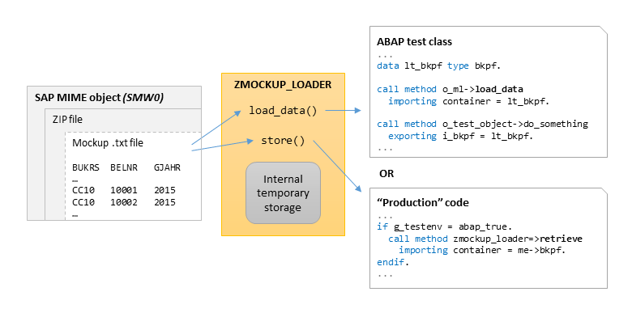
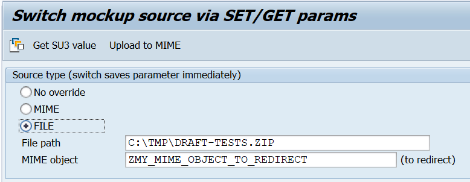

<!-- markdownlint-disable first-line-heading -->


# Mockup Loader for ABAP unit testing


*[history of changes](/changelog.txt)*

Mockup loader is a tool to simplify data preparation for SAP ABAP unit tests. Create unit test data in Excel, easily convert it into MIME object that travels with ABAP package, easily consume the data from your unit test code. The tool was created with the following high level goals in mind:

- simplify **communication process between a developer and a business analyst** (from client side in particular)
- simplify test data preparation and maintenance - do and store it in Excel (and commit the Excel file to git)
- simplify test data consumption - in particular, reduce volume of code required for a complex data tests

Features:

- Interface stubbing - dynamically create double implementations of data accessor interfaces and connect their methods to files in mocks. Does not depend on ABAP test double framework. See *'Data delivery'* section
- Singleton memory storage to be able to substitute data selections in the legacy code without data accessor interfaces. See *'Store/Retrieve'* section below
- Strict and non-strict parsing - skip irrelevant table fields in your test data
- "Deep" data loading - load master-detail structures in one step. See *'Deep data loading'* section
- Load source redirection - convenient utility to temporarily redirect loading from in-system-MIME object to local file, while you are working on or enhancing your test dataset. See *Load source redirection* section
- Tools to simplify conversion from Excel to MIME object inside the system, CI flows and viewing mocks
  - [mockup loader toolkit](https://github.com/sbcgua/mockup_loader_toolkit)
  - [mockup compiler JS](https://github.com/sbcgua/mockup-compiler-js)
- Utilities for table data filtering

## Contents

<!-- start toc -->

- [Synopsis](#synopsis)
- [Data delivery features](#data-delivery)
- [Installation](#installation)
- [Load source redirection](#load-source-redirection)
- [Conversion from Excel](#conversion-from-excel)
- [Examples and Reference](#examples-and-reference)
- [Contributing](#contributing)
- [Publications](#publications)
- [License](#license)

<!-- end toc -->

## Synopsis

The tool is created to simplify data preparation/loading for SAP ABAP unit tests. In one of our projects we had to prepare a lot of table data for unit tests. For example, a set of content from `BKPF`, `BSEG`, `BSET` tables (FI document). The output of the methods under test is also often a table or a complex structure.

Hard-coding all of that data was not an option - too much to code, difficult to maintain and terrible code readability. So we decided to write a tool which would get the data from TAB delimited `.txt` files, which, in turn, would be prepared in Excel in a convenient way. Certain objectives were set:

- all the test data should be combined together in one file (zip)
- ... and uploaded to SAP - test data should be a part of the dev package (W3MI binary object would fit)
- loading routine should identify the file structure (fields) automatically and verify its compatibility with a target container (structure or table)
- it should also be able to safely skip fields, missing in `.txt` file, if required (*non strict* mode) e.g. when processing structures (like FI document) with too many fields, most of which are irrelevant to a specific test.

```abap
" Test class (o_ml is mockup_loader instance)
...
o_ml->load_data( " Load test data (structure) from mockup
  exporting
    i_obj       = 'TEST1/bkpf'
    i_strict    = abap_true
  importing
    e_container = ls_bkpf ).

o_ml->load_data( " Load test data (table) from mockup
  exporting
    i_obj       = 'TEST1/bseg'
    i_strict    = abap_false
  importing
    e_container = lt_bseg ).
...

" Call to the code-under-test
o_test_object->some_processing(
  exporting
    i_bkpf   = ls_bkpf
    it_bseg  = lt_bseg ).

assert_equals(...).
```

The first part of the code takes TAB delimited text file `bkpf.txt` in TEST1 directory (file names are case-**in**sensitive) of ZIP file uploaded as binary object via SMW0 transaction...

```text
BUKRS BELNR GJAHR BUZEI BSCHL KOART ...
1000  10    2015  1     40    S     ...
1000  10    2015  2     50    S     ...
```

... and puts it (with proper ALPHA exits and etc) to an internal table with `BSEG` line type.  

On-the-fly data filtering is supported. For more information see [REFERENCE.md](docs/REFERENCE.md).

## Data delivery

### Interface stubbing

Since 2.0.0 mockup loader supports generating of interface stubs. :tada:

It creates an instance object which implements the given interface where one or more methods retrieve the data from the mockup.

- Optional filtering is supported:
  - thus one of the method parameters is treated as the value to filter the mockup data by the given key field
  - Multiple field filtering also supported
  - Single-value and ranges are supported, as well as addressing structure attribute!

```abap
  data lo_factory type ref to zcl_mockup_loader_stub_factory.
  data lo_ml      type ref to zcl_mockup_loader.
  
  lo_ml = zcl_mockup_loader=>create(
    i_type = 'MIME'
    i_path = 'ZMOCKUP_LOADER_EXAMPLE' ). " <INIT YOUR MOCKUP>

  create object lo_factory
    exporting
      io_ml_instance   = lo_ml
      i_interface_name = 'ZIF_MOCKUP_LOADER_STUB_DUMMY'. " <YOUR INTERFACE TO STUB>

  " Connect one or MANY methods to respective mockups 
  lo_factory->connect_method(
    i_method_name     = 'TAB_RETURN'         " <METHOD TO STUB>
    i_mock_name       = 'EXAMPLE/sflight' ). " <MOCK PATH>

  data li_ifstub type ref to ZIF_MOCKUP_LOADER_STUB_DUMMY. 
  li_ifstub ?= lo_factory->generate_stub( ).

  " Pass the stub to code-under-test, the effect is:
  ...
  data lt_res type flighttab.
  lt_res = li_ifstub->tab_return( i_connid = '1000' ).
  " lt_res contains the mock data ...
```

... and with filtering

```abap
  ...
  lo_factory->connect_method(
    i_method_name     = 'TAB_RETURN'         " <METHOD TO STUB>
    i_sift_param      = 'I_CONNID'           " <FILTERING PARAM>
    i_mock_tab_key    = 'CONNID'             " <MOCK HEADER FIELD>
    i_mock_name       = 'EXAMPLE/sflight' ). " <MOCK PATH>
  ...
```

This will result in the data set where key field `CONNID` will be equal to `I_CONNID` parameter actually passed to interface call.

- Structured addressing also supported, e.g. `IS_PARAMS-CONNID`.
- ranges also supported - `I_CONNID` above can be a range parameter

`Returning`, `exporting` and `changing` parameters are supported. For more information see [REFERENCE.md](docs/REFERENCE.md).

In addition, forwarding calls to another object (implementing same interface) is supported. For example if some of accessor methods must be connected to mocks and some others were implemented manually in a supporting test (or real production) class. See [REFERENCE.md](docs/REFERENCE.md).

It is possible to return just one field of the first matching record e.g. Document type of a document selected by number. For this specify the field to return in `I_FIELD_ONLY` param. See [REFERENCE.md](docs/REFERENCE.md).

And finally a feature that is not related to mocks - passing `I_CONST_VALUE` would return this value instead of loading data from text mock.


#### String connectors

Available since v2.1.6.

The above `connect_method/proxy` configuration can be also done with a single string. See [REFERENCE.md](docs/REFERENCE.md#connect) for details.

```abap
  ...
  lo_factory->connect( 'tab_return -> EXAMPLE/sflight' ).
  lo_factory->connect( 'tab_return -> EXAMPLE/sflight [connid = i_connid]' ).
  lo_factory->connect( 'tab_return -> EXAMPLE/sflight [connid = "XYZ_ID"]' ).
  lo_factory->connect( 'tab_return -> EXAMPLE/sflight(this_field_only) [connid = i_connid]' ).
  lo_factory->connect( 'tab_return -> EXAMPLE/sflight(?) [connid = i_connid]' ). " boolc("record exists")
  lo_factory->connect( 'tab_export(e_tab) -> EXAMPLE/sflight' ). " write output to e_tab param (exports)
  lo_factory->connect( 'tab_return -> ~EXAMPLE/sflight [connid = i_connid]' ). " corresponding only
  lo_factory->connect( 'tab_return -> =exact_value' ).
  lo_factory->connect( 'tab_return -> *' ). " proxy

  " and also a shorter version, using the set_default_mock()
  lo_factory->set_default_mock( 'EXAMPLE' ).
  lo_factory->connect( 'tab_return -> ./sflight [connid = i_connid]' ).

  " Multi condition also supported
  lo_factory->connect( 'tab_return -> ./sflight [connid = i_connid, fldate = i_fldate]' ). " AND
  lo_factory->connect( 'tab_return -> ./sflight [connid = i_connid & fldate = i_fldate]' ). " AND
  lo_factory->connect( 'tab_return -> ./sflight [connid = i_connid | fldate = i_fldate]' ). " OR
  lo_factory->connect( 'tab_return_2conn -> ./sflight [connid = i_connid | connid = i_connid2 ]' ). " Same field multi-filtert

  " Multiple connection for exporting params of the same method is supported
  lo_factory->connect( 'read_sales_invoice(e_vbrk) -> ./vbrk [vbeln = i_vbeln]' ).
  lo_factory->connect( 'read_sales_invoice(e_vbrp) -> ./vbrp [vbeln = i_vbeln]' ). " Same method, another exporting param
```

#### Stub control

Generated stub instance implements `ZIF_MOCKUP_LOADER_STUB_CONTROL` interface, which allows:

- temporarily enable/disable separate or all stubbed methods, which might be useful for some specific testing situations
- accessing to call counters (method was called X times)
- in plans: potentially, caching call parameters

### Deep data loading

Available since v2.1.0.

If you have a target data with deep fields - tables or structures - it is possible to fill them in one run. Let's consider a simple example: assume you have 2 linked tables - header and lines - the tables are represented by **separate** files in zip.

```text
DOCUMENT
========
ID   DATE   ...
1    ...
2    ...

LINES
========
DOCID   LINEID   AMOUNT   ...
1       1        100.00   ...
1       2        123.00   ...
2       1        990.00   ...
```

The target structure is:

```abap
types:
  begin of ty_line,
    docid  type numc10,
    lineid type numc3,
    " ...
  end of ty_line,
  tt_line type table of ty_line,
  begin of ty_document,
    id   type numc10,
    " ...
    lines type tt_line, " <<< DEEP FIELD, supposed to be filled with lines of the document
  end of ty_document.
  tt_documents type table of ty_document.
```

The following code will load this kind of structure

```abap
  o_ml->load_data(
    exporting
      i_obj  = 'path_to_head_file'
      i_deep = abap_true            " <<< ENABLE DEEP LOADING
    importing
      e_container = lt_docs ).      " <<< type tt_documents
```

To instruct mockup loader how to find the data for deep components you have to fill these components in the text in special format: `<source_path>[<source_id_field>=<value|@reference_field>]` which means *"go find `source_path` file, parse it, extract the lines, filter those where `source_id_field` = `value` or `reference_field` value of the current header record"*. For example:

```text
DOCUMENT
========
ID   DATE   ...   LINES
1    ...          path_to_lines_file[docid=@id]
2    ...          path_to_lines_file[docid=12345]
```

For the first record the mockup loader will find file `path_to_lines_file.txt` and load the lines with `docid` = `1` (value of `id` field of the first record). For the second record the explicit value `12345` will be used as the filter.

### Store/Retrieve

**Disclaimer**: *There is an opinion that adding test-related code to the production code is a 'code smell'. I sincerely agree in general. If the code was designed to use e.g. accessor interfaces from the beginning this is good. Still 'store' functionality can be useful for older pieces of code to be tested without much refactoring.*



Some code is quite difficult to test when it has a *db select* in the middle. Of course, good code design would assume isolation of DB operations from business logic code, but it is not always possible (or was not done in proper time). So we needed to create a way to substitute *selects* in code to a simple call, which would take the prepared test data instead if test environment was identified. We came up with the solution we called `store`.

```abap
" Test class (o_mls is mockup_loader_STORE instance)
...
o_mls->store( " Store some data with 'BKPF' label
  i_name = 'BKPF'
  i_data = ls_bkpf ). " One line structure
...

" Working class method
...
if is_test_env = abap_false. " Production environment detected
  select ... from db ...

else.                        " Test environment detected
  zcl_mockup_loader_store=>retrieve(
    exporting i_name  = 'BKPF'
    importing e_data  = ls_fi_doc_header
    exceptions others = 4 ).
endif. 

if sy-subrc is not initial.
  " Data not selected -> do error handling
endif.

```

In case of multiple test cases it can also be convenient to load a number of table records and then **filter** it based on some key field, available in the working code. This option is also possible:

``` abap
" Test class
...
o_mls->store( " Store some data with 'BKPF' label
  i_name   = 'BKPF'
  i_tabkey = 'BELNR'    " Key field for the stored table
  i_data   = lt_bkpf ). " Table with MANY different documents
...

" Working class method
...
if is_test_env = abap_false. " Production environment detected
  " Do DB selects here 

else.                        " Test environment detected
  zcl_mockup_loader_store=>retrieve(
    exporting
      i_name  = 'BKPF'
      i_sift  = l_document_number " <<< Filter key from real local variable
    importing
      e_data  = ls_fi_doc_header  " Still a flat structure here
    exceptions others = 4 ).
endif. 

if sy-subrc is not initial.
  " Data not selected -> error handling
endif.

```  

As the final result we can perform completely dynamic unit tests, covering most of code, including *DB select* related code **without** actually accessing the database. Of course, it is not only the mockup loader which ensures that. This requires accurate design of the project code, separating DB selection and processing code. The mockup loader and "store" functionality makes it more convenient.

The `zcl_mockup_loader` has a *shortcut* method `load_and_store` to load data to the store directly without technical variables. For more information see [REFERENCE.md](docs/REFERENCE.md).

Some design facts about the `store`:

- The store class `ZCL_MOCKUP_LOADER_STORE` is designed as a singleton class. So it is initiated once in a test class and the exists in one instance only.
- `RETRIEVE` method, which takes data from the "Store" is **static**. It is assumed to be called from "production" code instead of *DB selects*. It acquires the instance inside and throws **non-class** based exception on error. This is made to avoid the necessity to handle test-related exceptions, irrelevant to the main code, and also to be able to catch the exception as `SY-SUBRC` value. `SY-SUBRC` can be checked later similarly to regular DB select. So the interference with the main code is minimal.

## Installation

The most convenient way to install the package is to use [abapGit](https://github.com/larshp/abapGit) - it is easily installed itself and then a couple of click to clone the repo into the system. There is also an option for offline installation - download the repo as zip file and import it with abapGit. Unit test execution is always recommended after installation.

Dependencies (to install before mockup loader):

- [text2tab](https://github.com/sbcgua/text2tab) - tab-delimited text parser (was a part of *mockup loader* but now a separate reusable tool). Mandatory prerequisite.

## Load source redirection

Zipped mockups slug is supposed to be uploaded as a MIME object via SMW0. However, during data or test creation, it is more convenient (and faster) to read local file. In particular, not to upload 'draft' test data to the system before it is ready, interfering with other developers. It is also very convenient to use in conjunction with [java script mockup compiler](https://github.com/sbcgua/mockup-compiler-js) (see "Conversion from Excel" section below).

To normally code the mockup source via `i_type` and `i_path` parameters to the `create` method. To **temporarily** switch to another source you can use the transaction `ZMOCKUP_LOADER_SWSRC`. It will initialize SET/GET parameters `ZMOCKUP_LOADER_STYPE` and `ZMOCKUP_LOADER_SPATH`/`ZMOCKUP_LOADER_SMIME` which will **override** defaults for the current session only.



Code-wise, you can also find out if the mockup loader instance is redirected by calling `is_redirected` method. E.g. to issue redirection warning within your unit tests (see example in [REFERENCE.md](docs/REFERENCE.md))

User's manual:

- Type change in the selection screen immediately changes the parameters in session memory, no run is required (**'enter' must be pressed** though after manual text fields change to trigger `on screen` event)
- `Upload to MIME` toolbar button uploads the file to MIME storage instead of going through `SMW0` (the MIME object must exist)
- Saving variants is also convenient. You can then call the variant by `Variants` or `My variants` (created by your user) toolbar commands. Prefer these commands to the native variant selection (the very first button), because native variant command does not trigger `on screen`, so you must press Enter after choosing your variant (which is less convenient).

## Conversion from Excel

You may have a lot of data prepared in Excel files. Many files, many sheets in each. Although Ctrl+C in Excel actually copies TAB-delimited text, which greatly simplifies the matter for minor cases, it is boring and time consuming to copy all the test cases to text. Here are special tools to simplify this workflow. Briefly: they take directory of excel files with mockup data and convert them into format compatible with mockup loader.

- [mockup compiler](https://github.com/sbcgua/mockup_loader_toolkit) - ABAP implementation.

  

- [mockup compiler JS](https://github.com/sbcgua/mockup-compiler-js) - java script implementation, requires nodejs environment at the developer's machine. This tool also make it possible to compile the target zip **via continuous integration flows** - so the test data in excel can be a part of source repository. (I'm planning a dedicated publication on this subject).

See [EXCEL2TXT.md](docs/EXCEL2TXT.md) for more info.

## Examples and Reference

- Complete reference of classes and methods can be found in [REFERENCE.md](docs/REFERENCE.md).
- A simple example can be found in [/src/zmockup_loader_example.prog.abap](/src/zmockup_loader_example.prog.abap).
- Also see unit tests - these are the most up-to-date examples
- Have a look at the how-to section in the project [Wiki](../../wiki).
- [Gitlab CI example](https://gitlab.com/atsybulsky/ut-monitor-example) - idea is to commit UTs sources as well as SMW0 object to repo and see the **text-based diffs** (which is not possible for binary objects obviously)

## Contributing

You are welcomed to suggest ideas and code improvements ! :) Let's make ABAP development more convenient. Please kindly respect the [code conventions](/CONTRIBUTING.md)

## Publications

- [Unit testing mockup loader for ABAP @SCN](http://scn.sap.com/community/abap/blog/2015/11/12/unit-testing-mockup-loader-for-abap)
- [How to do convenient multi-case unit tests with zmockup_loader @SCN](http://scn.sap.com/community/abap/blog/2016/03/20/how-to-do-convenient-multicase-test-with-zmockuploader)
- [zmockup_loader and unit tests with interface stubbing](https://blogs.sap.com/?p=712675)
- [zmockup_loader: unit test data preparation flow](https://blogs.sap.com/?p=714903)

## License

The code is licensed under MIT License. Please see the [LICENSE](/LICENSE) for details.
