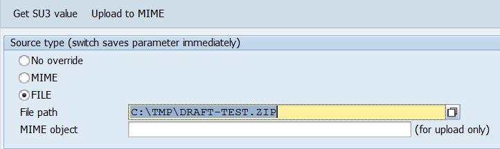
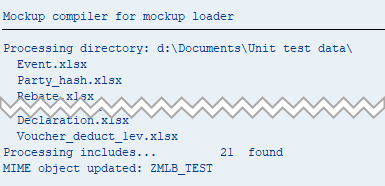

# Mockup Loader for ABAP unit testing

*Version: 2.0.0-beta*    
*[History of changes](/changelog.txt)*    

## Major changes in version 2

- `zcl_mockup_loader` split into several classes to separate loading, store and utils
- parsing logic is separated into [abap_data_parser](https://github.com/sbcgua/abap_data_parser) which is now a prerequisite. Sorry for this. We believe this is for good.
- `zcl_mockup_loader` is not a singleton anymore. Must be instantiated with `create` method. `zcl_mockup_loader_store` remained the singleton.
- VBA zip compiler depreciated, see below 'Conversion to Excel' section
- TODO new upcoming feature ... ;)

## Contents

<!-- start toc -->

- [Synopsis](#synopsis)
- [Installation](#installation)
- [Load source redirection](#load-source-redirection)
- [Conversion from Excel](#conversion-from-excel)
- [Reference](#reference)
- [Examples](#examples)
- [Contributors](#contributors)
- [Publications](#publications)
- [License](#license)

<!-- end toc -->

## Synopsis

The tool is created to simplify data preparation/loading for SAP ABAP unit tests. In one of our projects we had to prepare much tables data for unit tests. For example, a set of content from `BKPF`, `BSEG`, `BSET` tables (FI document). The output of the methods under test is also often a table or a complex structure. 

Hard-coding all of that data was not an option - too much to code, difficult to maintain and terrible code readability. So we decided to write a tool which would get the data from TAB delimited `.txt` files, which, in turn, would be prepared in Excel in a convenient way. Certain objectives were set:

- all the test data should be combined together in one file (zip)
- ... and uploaded to SAP - test data should be a part of the dev package (W3MI binary object would fit)
- loading routine should identify the file structure (fields) automatically and verify its compatibility with a target container (structure or table) 
- it should also be able to safely skip fields, missing in `.txt` file, if required (*non strict* mode) e.g. when processing structures (like FI document) with too many fields, most of which are irrelevant to a specific test.

```abap
" Test class (o_ml is mockup_loader instance)
...
call method o_ml->load_data " Load test data (structure) from mockup
  exporting i_obj       = 'TEST1/bkpf'
  importing e_container = ls_bkpf.

call method o_ml->load_data " Load test data (table) from mockup
  exporting i_obj       = 'TEST1/bseg'
            i_strict    = abap_false
  importing e_container = lt_bseg.

...

" Call to the code being tested
call method o_test_object->some_processing
  exporting i_bkpf   = ls_bkpf
            it_bseg  = lt_bseg.

assert_equals(...).
```

The first part of the code takes TAB delimited text file `bkpf.txt` in TEST1 directory of ZIP file uploaded as binary object via SMW0 transaction...

```
BUKRS BELNR GJAHR BUZEI BSCHL KOART ...
1000  10    2015  1     40    S     ...
1000  10    2015  2     50    S     ...
```

... and puts it (with proper ALPHA exits and etc) to an internal table with `BSEG` line type.  

### Store/Retrieve ###

**Disclaimer**: *There is an opinion that adding test-related code to the production code is a 'code smell'. I sincerely agree in general. If the code was designed to use e.g. accessor interfaces from the beginning this is good. Still 'store' functionality can be useful for some older code to be tested without much refactoring.*

Later another objective was identified: some code is quite difficult to test when it has a *db select* in the middle. Of course, good code design would assume isolation of DB operations from business logic code, but it is not always possible (or was not done in proper time). So we needed to create a way to substitute *selects* in code to a simple call, which would take the prepared test data instead if test environment was identified. We came up with the solution we called `store`. 
   

```abap
" Test class (o_mls is mockup_loader_STORE instance)
...
call method o_mls->store " Store some data with 'BKPF' label
  exporting i_name = 'BKPF'
            i_data = ls_bkpf. " One line structure
...

" Working class method
...
if some_test_env_indicator = abap_false. " Production environment
  " Do DB selects here 

else.                                    " Test environment
  call method zcl_mockup_loader_store=>retrieve
    exporting i_name  = 'BKPF'
    importing e_data  = ls_fi_doc_header
    exceptions others = 4.
endif. 

if sy-subrc is not initial.
  " Data not selected -> do error handling
endif.

```

In case of multiple test cases it can also be convenient to load a number of table records and then **filter** it based on some key field, available in the working code. This option is also possible:

``` abap
" Test class
...
call method o_mls->store " Store some data with 'BKPF' label
  exporting i_name   = 'BKPF'
            i_tabkey = 'BELNR'  " Key field for the stored table
            i_data   = lt_bkpf. " Table with MANY different documents
...

" Working class method
...
if some_test_env_indicator = abap_false. " Production environment
  " Do DB selects here 

else.                                    " Test environment
  call method zcl_mockup_loader_store=>retrieve
    exporting i_name  = 'BKPF'
              i_sift  = l_document_number " Filter key from real local variable
    importing e_data  = ls_fi_doc_header  " Still a flat structure here
    exceptions others = 4.
endif. 

if sy-subrc is not initial.
  " Data not selected -> error handling
endif.

```  

As the final result we can perform completely dynamic unit tests, covering most of code, including *DB select* related code **without** actually accessing the database. Of course, it is not only the mockup loader which ensures that. This requires accurate design of the project code, separating DB selection and processing code. But the mockup loader and "store" functionality makes it more convenient.  


Some design facts about `store`:

- The store class `ZCL_MOCKUP_LOADER_STORE` is designed as a singleton class. So it is initiated once in a test class and the exists in one instance only.
- `RETRIEVE` method, which takes data from the "Store" is **static**. It is assumed to be called from "production" code instead of *DB selects*. It acquires the instance inside and throws **non-class** based exception on error. This is made to avoid the necessity to handle test-related exceptions, irrelevant to the main code, and also to be able to catch the exception as `SY-SUBRC` value. `SY-SUBRC` can be checked later as if it would be the result of a regular DB select. So the interference with the main code is minimal. 

## Installation

The most convenient way to install the package is to use [abapGit](https://github.com/larshp/abapGit) - it is easily installed itself and then a couple of click to clone the repo into the system. There is also an option for offline installation - download the repo as zip file and import it with abapGit. Unit test execution is always recommended after-installation.

Dependencies (to install before mockup loader):
- [abap_data_parser](https://github.com/sbcgua/abap_data_parser) - tab-delimited text parser (was a part of *mockup loader* but now a separate reusable tool)
- [abap_w3mi_poller](https://github.com/sbcgua/abap_w3mi_poller) - *optional* - enables 'Upload to MIME' button in `ZMOCKUP_LOADER_SWSRC`. The mockup loader **can**  be compiled without this package (the call is dynamic).

## Load source redirection

Zipped mockups slug is supposed to be uploaded as MIME object via SMW0. However, during data or test creation, it is more convenient (faster) to read local file. Also not to upload 'draft' test data to the system.

You pass `i_type` and `i_path` parameters to the `create` method to define the 'normal' mockup source. To temporarily switch to another source you can use the transaction `ZMOCKUP_LOADER_SWSRC`. It will initialize SET/GET parameters  `ZMOCKUP_LOADER_STYPE` and `ZMOCKUP_LOADER_SPATH(MIME)` which will **override** defaults for the current session only.



N.B. Type change in the selection screen immediately changes the parameters in session memory, no run is required. `Get SU3` reads param values from user master (useful when you work on the same project for some time). `Upload to MIME` uploads the file to MIME storage (requires [abap_w3mi_poller](https://github.com/sbcgua/abap_w3mi_poller) to be installed).

## Conversion from Excel

You may have a lot of data prepared in Excel files. Many files, many sheets in each. Although Ctrl+C in Excel actually copies TAB-delimited text, which greatly simplifies the matter for minor cases, it is boring and time consuming to copy all the test cases to text. Here are special tools to simplify this workflow. Briefly: they take directory of excel files with mockup data and convert them into format compatible with mockup loader.

- [mockup compiler](https://github.com/sbcgua/mockup_compiler) - ABAP implementation, requires [abap2xlsx](https://github.com/ivanfemia/abap2xlsx) installed.
- [mockup compiler JS](https://github.com/sbcgua/mockup-compiler-js) - java script implemenation, requires nodejs environment at the developer's machine.

See [EXCEL2TXT.md](EXCEL2TXT.md) for more info.



## Reference

Complete reference of classes and methods can be found in [REFERENCE.md](REFERENCE.md). 

## Examples

- Have a look at the howto section in the project [Wiki](../../wiki).
- A simple example can be found in [/src/zmockup_loader_example.prog.abap](/src/zmockup_loader_example.prog.abap).

## Contributors

Major contributors are described in [CONTRIBUTORS.md](/CONTRIBUTORS.md). You are welcomed to suggest ideas and code improvements ! :)

## Publications

- [Unit testing mockup loader for ABAP @SCN](http://scn.sap.com/community/abap/blog/2015/11/12/unit-testing-mockup-loader-for-abap)
- [How to do convenient multicase unit tests with zmockup_loader @SCN](http://scn.sap.com/community/abap/blog/2016/03/20/how-to-do-convenient-multicase-test-with-zmockuploader)

## License

The code is licensed under MIT License. Please see [LICENSE](/LICENSE) for details.
